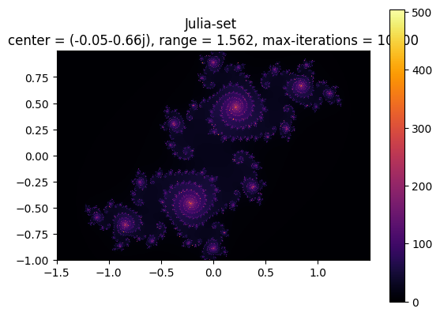
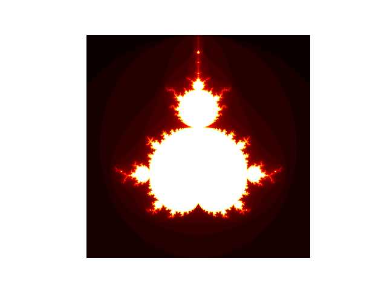
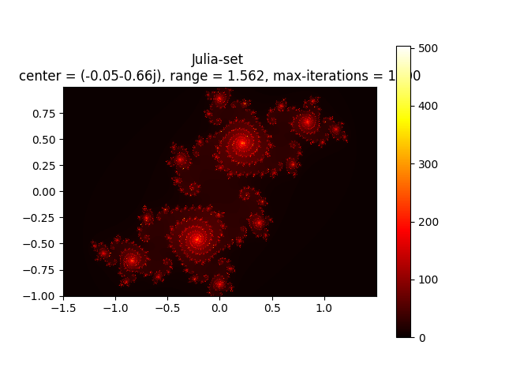

# Fractaller
Fractaller is a powerful fractal generation tool that lets you explore the fascinating world of mathematical art. With an intuitive user interface, you can generate stunning visualizations of both Mandelbrot and Julia sets with just a few clicks.

if you are a digital artist or just someone who loves intricate fractal patterns, you could generate cool fractal patterns with this!
# Examples
 







## Features

- Madelbrot Fractal Generation
- Julia Fractal Generation
- Customisable
- Tons of Cool ColorMaps
- Save Frcatal Images

## Installation

Install Fractaller with git

```bash
  git clone https://github.com/AnuroopVJ/Fractaller.git
```
    
## Screenshot


## Tech Stack

**Python, Customtkinter, matplotlib, numpy, PIL**
